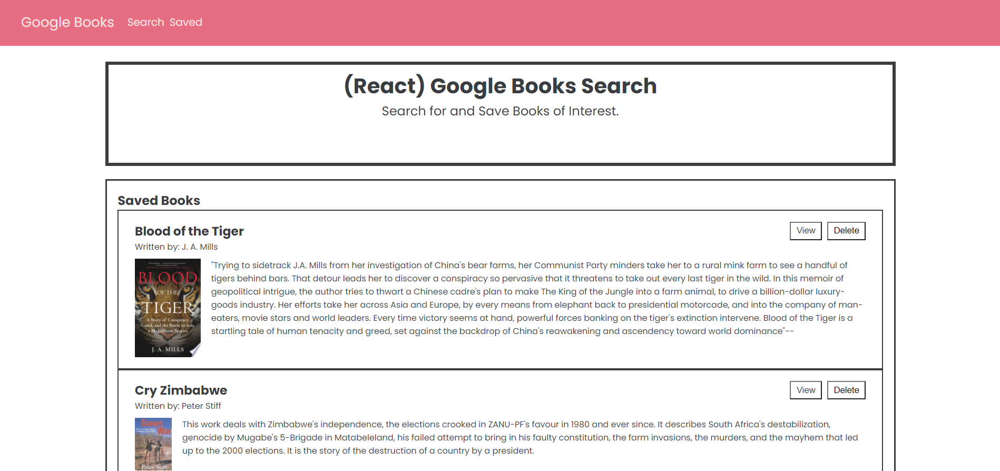

# hw-week-twenty-one

  
  ## Project Description

  This project is a simple full stack application utilizing the MERN stack (MongoDB, Express.js, React.js, and Node.js). The live deployment of this application can be experienced at the link below.
  
  A live demo of this application can be found at: https://jaymanw.github.io/hw-week-twenty-one/

  ## Table of Contents

  [Installation](#installation)

  [Usage](#usage)

  [License](#license)

  [Contributing](#contributing)
  
  [Questions/Contact](#questions)

  ## Installation
  
  *Note: node.js/NPM must be installed on your system for this program to function. You can find the respective downlaod here: https://nodejs.org/. Additionally a worki*

  Upon successful cloning/downloading of this repo, begin by navigating to the repository and running the following command in your terminal to download the necessary dependencies.

  ~~~
  npm i
  ~~~
  
  Once you have navigated to the "Develop" directory, run the following command to launch the program.
  
  ~~~
  npm start
  ~~~

  ## Usage

  Download or clone this repo and install necessary dependencies (see Instructions for more details).

  ## License

  

  This project is registered under the MIT license.

  To learn more about this license, visit (https://choosealicense.com/licenses/mit/)

  ## Questions

  If you have any questions, comments, or concerns about this project, you can reach me at the following links:
  
  Email: jaymanw2000@gmail.com
  
  GitHub: [JaymanW](https://github.com/JaymanW)
